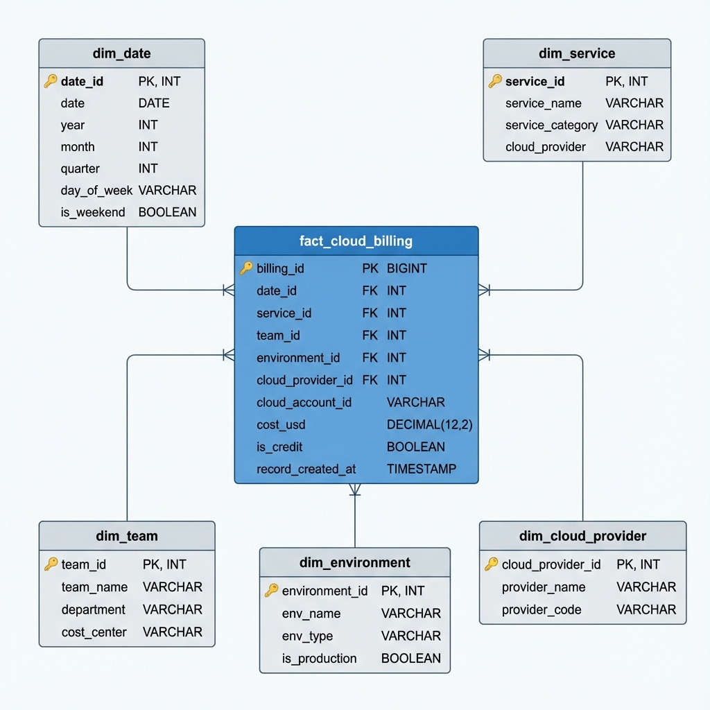

# Part B: Data Modeling
## K&Co Cloud Cost Intelligence Platform

---

## Overview

This document presents the data warehouse schema design for K&Co's multi-cloud billing analytics platform. The design follows a **star schema** pattern optimized for analytical queries and BI reporting.

---

## Entity-Relationship Diagram



---

## Schema Design

### Fact Table: `fact_cloud_billing`

**Purpose:** Central fact table storing daily aggregated cloud billing records

**Grain:** One record per day, per cloud account, per service, per team, per environment

| Column Name | Data Type | Description | Constraints |
|------------|-----------|-------------|-------------|
| `billing_id` | BIGINT | Surrogate primary key | PK, AUTO_INCREMENT |
| `date_id` | INT | Foreign key to dim_date | FK, NOT NULL |
| `service_id` | INT | Foreign key to dim_service | FK, NOT NULL |
| `team_id` | INT | Foreign key to dim_team | FK, NOT NULL |
| `environment_id` | INT | Foreign key to dim_environment | FK, NOT NULL |
| `cloud_provider_id` | INT | Foreign key to dim_cloud_provider | FK, NOT NULL |
| `cloud_account_id` | VARCHAR(50) | AWS account ID or GCP project ID | NOT NULL |
| `cost_usd` | DECIMAL(12,2) | Daily cost in USD | NOT NULL |
| `is_credit` | BOOLEAN | Flag for credits/refunds (negative costs) | DEFAULT FALSE |
| `record_created_at` | TIMESTAMP | ETL load timestamp | DEFAULT CURRENT_TIMESTAMP |

**Indexes:**
- Primary Key: `billing_id`
- Composite Index: `(date_id, cloud_provider_id, service_id)` for time-series queries
- Index: `(team_id, environment_id)` for team-based reporting
- Index: `(cloud_account_id)` for account-level analysis

---

### Dimension Table: `dim_date`

**Purpose:** Date dimension for time-based analysis

| Column Name | Data Type | Description | Constraints |
|------------|-----------|-------------|-------------|
| `date_id` | INT | Surrogate primary key (YYYYMMDD format) | PK |
| `date` | DATE | Actual date | NOT NULL, UNIQUE |
| `year` | INT | Year (2025) | NOT NULL |
| `month` | INT | Month (1-12) | NOT NULL |
| `quarter` | INT | Quarter (1-4) | NOT NULL |
| `day_of_week` | VARCHAR(10) | Day name (Monday, Tuesday, etc.) | NOT NULL |
| `is_weekend` | BOOLEAN | Weekend flag | NOT NULL |
| `month_name` | VARCHAR(10) | Month name (January, February, etc.) | NOT NULL |
| `fiscal_year` | INT | Fiscal year (if different from calendar) | |
| `fiscal_quarter` | INT | Fiscal quarter | |

**Pre-populated:** This dimension should be pre-populated with all dates for the expected data range (e.g., 2020-2030).

---

### Dimension Table: `dim_service`

**Purpose:** Cloud service catalog

| Column Name | Data Type | Description | Constraints |
|------------|-----------|-------------|-------------|
| `service_id` | INT | Surrogate primary key | PK, AUTO_INCREMENT |
| `service_name` | VARCHAR(100) | Service name (EC2, Compute Engine, etc.) | NOT NULL, UNIQUE |
| `service_category` | VARCHAR(50) | Category (Compute, Storage, Database, etc.) | NOT NULL |
| `cloud_provider` | VARCHAR(20) | Cloud provider (AWS, GCP, Azure) | NOT NULL |
| `service_description` | TEXT | Detailed description | |
| `is_active` | BOOLEAN | Active status | DEFAULT TRUE |

**Sample Data:**
```sql
INSERT INTO dim_service VALUES
(1, 'EC2', 'Compute', 'AWS', 'Elastic Compute Cloud', TRUE),
(2, 'Compute Engine', 'Compute', 'GCP', 'Google Compute Engine', TRUE),
(3, 'RDS', 'Database', 'AWS', 'Relational Database Service', TRUE),
(4, 'Cloud SQL', 'Database', 'GCP', 'Google Cloud SQL', TRUE);
```

---

### Dimension Table: `dim_team`

**Purpose:** Team/organizational structure

| Column Name | Data Type | Description | Constraints |
|------------|-----------|-------------|-------------|
| `team_id` | INT | Surrogate primary key | PK, AUTO_INCREMENT |
| `team_name` | VARCHAR(50) | Team name (Core, Web, Data) | NOT NULL, UNIQUE |
| `department` | VARCHAR(50) | Department name | |
| `cost_center` | VARCHAR(20) | Cost center code | |
| `team_lead` | VARCHAR(100) | Team lead name | |
| `budget_usd` | DECIMAL(12,2) | Monthly budget | |

**Sample Data:**
```sql
INSERT INTO dim_team VALUES
(1, 'Core', 'Engineering', 'CC-001', 'John Doe', 50000.00),
(2, 'Web', 'Engineering', 'CC-002', 'Jane Smith', 75000.00),
(3, 'Data', 'Analytics', 'CC-003', 'Bob Johnson', 60000.00);
```

---

### Dimension Table: `dim_environment`

**Purpose:** Environment classification

| Column Name | Data Type | Description | Constraints |
|------------|-----------|-------------|-------------|
| `environment_id` | INT | Surrogate primary key | PK, AUTO_INCREMENT |
| `env_name` | VARCHAR(20) | Environment name (prod, staging, dev) | NOT NULL, UNIQUE |
| `env_type` | VARCHAR(20) | Environment type (production, non-production) | NOT NULL |
| `is_production` | BOOLEAN | Production flag | NOT NULL |
| `cost_allocation_pct` | DECIMAL(5,2) | % of costs to allocate to this env | DEFAULT 100.00 |

**Sample Data:**
```sql
INSERT INTO dim_environment VALUES
(1, 'prod', 'production', TRUE, 100.00),
(2, 'staging', 'non-production', FALSE, 100.00),
(3, 'dev', 'non-production', FALSE, 100.00);
```

---

### Dimension Table: `dim_cloud_provider`

**Purpose:** Cloud provider reference

| Column Name | Data Type | Description | Constraints |
|------------|-----------|-------------|-------------|
| `cloud_provider_id` | INT | Surrogate primary key | PK, AUTO_INCREMENT |
| `provider_name` | VARCHAR(50) | Provider name (Amazon Web Services, Google Cloud Platform) | NOT NULL |
| `provider_code` | VARCHAR(10) | Short code (AWS, GCP, Azure) | NOT NULL, UNIQUE |
| `billing_account_id` | VARCHAR(50) | Master billing account | |
| `is_active` | BOOLEAN | Active status | DEFAULT TRUE |

**Sample Data:**
```sql
INSERT INTO dim_cloud_provider VALUES
(1, 'Amazon Web Services', 'AWS', 'master-billing-123', TRUE),
(2, 'Google Cloud Platform', 'GCP', 'billing-account-456', TRUE),
(3, 'Microsoft Azure', 'Azure', 'subscription-789', TRUE);
```

---

## Grain Definition

**Fact Table Grain:** One record per **day** per **cloud account** per **service** per **team** per **environment**

This means:
- If the Core team uses EC2 in production on AWS account 111111111111 on 2025-01-01, there will be **one record** with the aggregated cost for that day
- If multiple instances or resources exist, their costs are **pre-aggregated** before loading into the fact table
- This grain balances query performance with analytical flexibility

---

## Primary & Foreign Keys

### Primary Keys
- `fact_cloud_billing.billing_id` (surrogate key)
- `dim_date.date_id` (natural key in YYYYMMDD format)
- `dim_service.service_id` (surrogate key)
- `dim_team.team_id` (surrogate key)
- `dim_environment.environment_id` (surrogate key)
- `dim_cloud_provider.cloud_provider_id` (surrogate key)

### Foreign Key Relationships
```sql
ALTER TABLE fact_cloud_billing
  ADD CONSTRAINT fk_date FOREIGN KEY (date_id) REFERENCES dim_date(date_id),
  ADD CONSTRAINT fk_service FOREIGN KEY (service_id) REFERENCES dim_service(service_id),
  ADD CONSTRAINT fk_team FOREIGN KEY (team_id) REFERENCES dim_team(team_id),
  ADD CONSTRAINT fk_environment FOREIGN KEY (environment_id) REFERENCES dim_environment(environment_id),
  ADD CONSTRAINT fk_cloud_provider FOREIGN KEY (cloud_provider_id) REFERENCES dim_cloud_provider(cloud_provider_id);
```

---

## Design Decisions

### 1. Star Schema vs. Snowflake Schema

**Decision:** Star schema

**Rationale:**
- **Simpler queries:** BI tools can easily join fact table to dimensions
- **Better performance:** Fewer joins required for most analytical queries
- **Easier maintenance:** Denormalized dimensions are easier to understand
- **Trade-off:** Some data redundancy in dimensions (acceptable for small dimension tables)

### 2. Surrogate Keys vs. Natural Keys

**Decision:** Surrogate keys for all dimensions except `dim_date`

**Rationale:**
- **Flexibility:** Allows dimension attributes to change without affecting fact table
- **Performance:** Integer keys are faster for joins than composite natural keys
- **Consistency:** Uniform key strategy across all dimensions
- **Exception for date:** Using YYYYMMDD format (e.g., 20250101) provides both readability and performance

### 3. Daily Grain

**Decision:** Daily aggregation (not hourly or monthly)

**Rationale:**
- **Matches source data:** AWS and GCP billing exports are typically daily
- **Query performance:** Smaller fact table than hourly grain
- **Analytical flexibility:** Can aggregate to weekly/monthly in queries
- **Storage efficiency:** Balances detail with table size

### 4. Separate `is_credit` Flag

**Decision:** Add boolean flag for credits instead of separate table

**Rationale:**
- **Simplicity:** Keeps all costs in one fact table
- **Query convenience:** Easy to filter or include credits
- **Addresses Part A risk:** Explicitly handles negative costs identified in profiling
- **Reporting flexibility:** Can show gross costs, credits, and net costs

### 5. Slowly Changing Dimensions (SCD)

**Decision:** Type 1 SCD (overwrite) for most dimensions

**Rationale:**
- **Simplicity:** No need to track historical changes for team names, service categories
- **Exception:** If team budgets or cost centers change frequently, consider Type 2 SCD with effective dates
- **Future enhancement:** Can add `effective_from` and `effective_to` columns if history tracking is needed

---

## Assumptions

1. **Data Volume:**
   - ~3,000 records per day across all clouds
   - ~1M records per year in fact table
   - Manageable with standard RDBMS (PostgreSQL, Snowflake, BigQuery)

2. **Query Patterns:**
   - Most queries filter by date range (last 30/90/365 days)
   - Common aggregations by team, service, environment
   - Cross-cloud comparisons (AWS vs GCP)
   - Month-over-month trending

3. **Data Freshness:**
   - Daily batch loads (not real-time)
   - Data available by 9 AM next day
   - Historical data does not change (immutable)

4. **Cloud Providers:**
   - Currently AWS and GCP
   - Schema extensible to Azure and other providers
   - No multi-cloud services (e.g., Databricks) in current scope

5. **Cost Allocation:**
   - Costs are already allocated to teams at source
   - No complex chargeback rules required
   - Shared services (if any) are pre-allocated

---

## Sample Queries

### Query 1: Monthly spend by cloud provider
```sql
SELECT 
    cp.provider_name,
    d.year,
    d.month,
    SUM(f.cost_usd) as total_cost
FROM fact_cloud_billing f
JOIN dim_cloud_provider cp ON f.cloud_provider_id = cp.cloud_provider_id
JOIN dim_date d ON f.date_id = d.date_id
WHERE d.year = 2025
GROUP BY cp.provider_name, d.year, d.month
ORDER BY d.year, d.month, cp.provider_name;
```

### Query 2: Top 5 services by cost
```sql
SELECT 
    s.service_name,
    s.service_category,
    cp.provider_code,
    SUM(f.cost_usd) as total_cost
FROM fact_cloud_billing f
JOIN dim_service s ON f.service_id = s.service_id
JOIN dim_cloud_provider cp ON f.cloud_provider_id = cp.cloud_provider_id
WHERE f.date_id >= 20250101 AND f.date_id <= 20250131
GROUP BY s.service_name, s.service_category, cp.provider_code
ORDER BY total_cost DESC
LIMIT 5;
```

### Query 3: Team spend by environment
```sql
SELECT 
    t.team_name,
    e.env_name,
    SUM(f.cost_usd) as total_cost,
    COUNT(*) as record_count
FROM fact_cloud_billing f
JOIN dim_team t ON f.team_id = t.team_id
JOIN dim_environment e ON f.environment_id = e.environment_id
JOIN dim_date d ON f.date_id = d.date_id
WHERE d.year = 2025 AND d.month = 1
GROUP BY t.team_name, e.env_name
ORDER BY t.team_name, total_cost DESC;
```

---

## Future Enhancements

1. **Add resource-level detail:** Create a separate fact table for individual resources (EC2 instances, RDS databases) for drill-down analysis

2. **Budget tracking:** Add `fact_budget` table to compare actual vs. budgeted costs

3. **Tagging dimension:** Create `dim_tags` for resource tags (environment, owner, project)

4. **Anomaly detection:** Add `fact_cost_anomaly` table to track detected anomalies

5. **Reserved instances:** Add dimension for RI/savings plan coverage

---

**Document Version:** 1.0  
**Design Date:** November 24, 2025  
**Designer:** Data Engineering Team  
**Status:** Ready for Implementation
