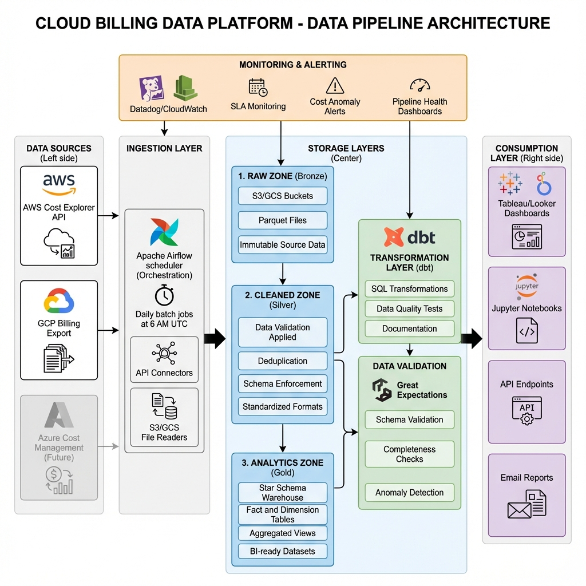

# Part D: Pipeline Design
## K&Co Cloud Cost Intelligence Platform

---

## Overview

This document outlines the architecture for a production-grade daily ingestion pipeline that processes multi-cloud billing data from AWS and GCP, transforms it into analytics-ready datasets, and serves it to BI dashboards and FinOps teams.

---

## Architecture Diagram



---

## 1. Data Sources

### AWS Cost Explorer API
- **Type:** REST API
- **Frequency:** Daily exports available by 6 AM UTC (next day)
- **Format:** JSON or CSV
- **Granularity:** Daily line items with tags
- **Authentication:** IAM role with `ce:GetCostAndUsage` permission
- **Rate Limits:** 5 requests per second

### GCP Billing Export
- **Type:** BigQuery table or Cloud Storage export
- **Frequency:** Continuous updates, daily snapshots
- **Format:** Parquet or CSV in GCS bucket
- **Granularity:** Daily usage records
- **Authentication:** Service account with `bigquery.dataViewer` role
- **Location:** `gs://billing-export-bucket/YYYY/MM/DD/`

### Future: Azure Cost Management
- **Status:** Planned for Q2 2026
- **Type:** Cost Management API
- **Format:** JSON

---

## 2. Ingestion Process

### Orchestration: Apache Airflow

**Why Airflow?**
- Industry-standard workflow orchestration
- Rich ecosystem of operators (AWS, GCP, Snowflake)
- Built-in retry logic and error handling
- Web UI for monitoring and debugging
- Supports complex dependencies and branching

**Alternative:** Cloud-native schedulers (AWS Step Functions, GCP Cloud Composer)

### Batch vs. Streaming Decision

**Choice: Daily Batch Processing**

**Rationale:**
1. **Source data cadence:** Billing data is inherently daily (not real-time)
2. **Cost efficiency:** Batch is cheaper than streaming for this use case
3. **Simplicity:** Easier to debug and maintain
4. **Sufficient freshness:** FinOps decisions don't require sub-daily data

**Streaming rejected because:**
- Billing APIs don't support streaming
- Adds complexity without business value
- Higher infrastructure costs

### Scheduling Strategy

**Daily Schedule:** 6:30 AM UTC (30 minutes after data availability)

**DAG Structure:**
```
start → check_data_availability → [extract_aws, extract_gcp] → 
validate_raw → load_to_raw_zone → transform_to_cleaned → 
validate_cleaned → load_to_analytics → refresh_dashboards → 
send_summary_email → end
```

**SLA:** Data available in analytics zone by 8 AM UTC (90-minute window)

---

## 3. Storage Layers (Medallion Architecture)

### Bronze Layer: Raw Zone
**Purpose:** Immutable landing zone for source data

**Technology:** AWS S3 / GCP Cloud Storage  
**Format:** Parquet (compressed with Snappy)  
**Partitioning:** `s3://raw-billing/cloud={aws|gcp}/year=YYYY/month=MM/day=DD/`  
**Retention:** 7 years (compliance requirement)  
**Access:** Restricted to ETL service accounts only

**Why Parquet?**
- Columnar format optimized for analytics
- 10x compression vs. CSV
- Schema evolution support
- Fast query performance

### Silver Layer: Cleaned Zone
**Purpose:** Validated, deduplicated, standardized data

**Technology:** Same as Bronze (S3/GCS)  
**Format:** Parquet  
**Partitioning:** `s3://cleaned-billing/year=YYYY/month=MM/`  
**Retention:** 3 years  
**Transformations Applied:**
- Schema validation (Great Expectations)
- Deduplication on composite key
- Data type enforcement
- Standardized column names
- Negative cost flagging (`is_credit`)

### Gold Layer: Analytics Zone
**Purpose:** Business-ready star schema for BI and reporting

**Technology:** Snowflake / BigQuery / Redshift  
**Schema:** Star schema (fact + dimensions from Part B)  
**Partitioning:** By `date_id` (monthly partitions)  
**Retention:** Indefinite (with archival to cold storage after 2 years)  
**Features:**
- Pre-aggregated monthly summaries (materialized views)
- Indexed for common query patterns
- Row-level security by team

---

## 4. Transformation Layer

### Tool: dbt (data build tool)

**Why dbt?**
- SQL-based transformations (familiar to analysts)
- Built-in testing and documentation
- Version control for data models
- Lineage tracking
- Incremental model support

**dbt Project Structure:**
```
dbt_project/
├── models/
│   ├── staging/
│   │   ├── stg_aws_billing.sql
│   │   └── stg_gcp_billing.sql
│   ├── intermediate/
│   │   └── int_unified_billing.sql
│   ├── marts/
│   │   ├── fact_cloud_billing.sql
│   │   ├── dim_date.sql
│   │   ├── dim_service.sql
│   │   └── dim_team.sql
│   └── aggregates/
│       ├── monthly_spend_by_provider.sql
│       └── top_services_by_cost.sql
├── tests/
│   ├── assert_no_duplicates.sql
│   ├── assert_positive_costs_for_non_credits.sql
│   └── assert_date_continuity.sql
└── docs/
    └── overview.md
```

**Transformation Steps:**
1. **Staging:** Load from cleaned zone, apply basic type casting
2. **Intermediate:** Union AWS + GCP, add `cloud_provider` column
3. **Marts:** Create star schema tables with surrogate keys
4. **Aggregates:** Pre-compute common metrics for dashboards

**Incremental Strategy:**
- Process only new/changed data (last 7 days)
- Full refresh on weekends for data quality
- Backfill capability for historical corrections

---

## 5. Data Validation

### Tool: Great Expectations

**Validation Checkpoints:**

**Raw Zone Validation:**
- File exists and is not empty
- Schema matches expected structure
- Date range is within expected window (today - 1 day)
- No completely null columns

**Cleaned Zone Validation:**
- No duplicate records on composite key
- All required fields are non-null
- Cost values are numeric
- Dates are valid and sequential
- Account/project IDs match regex patterns
- Service names are in approved list

**Analytics Zone Validation:**
- Foreign key integrity (all FKs exist in dimension tables)
- Fact table grain is maintained (no duplicates)
- Aggregated totals match source data
- No orphaned records

**Failure Handling:**
- **Critical failures:** Stop pipeline, alert on-call engineer
- **Warning failures:** Log and continue, notify data team
- **Validation results:** Stored in metadata database for trending

---

## 6. Monitoring & Alerting

### Metrics to Monitor

**Pipeline Health:**
- DAG success/failure rate
- Task duration (SLA: <90 minutes end-to-end)
- Data freshness (time since last successful run)
- Row counts (expected vs. actual)

**Data Quality:**
- Validation test pass rate
- Duplicate record count
- Missing date gaps
- Cost anomalies (>2σ from mean)

**Infrastructure:**
- Airflow worker CPU/memory usage
- Database query performance
- Storage costs (S3/GCS)
- API rate limit consumption

### Alerting Strategy

**Channels:**
- **PagerDuty:** Critical pipeline failures (P1)
- **Slack:** Data quality warnings, SLA breaches (P2)
- **Email:** Daily summary reports, weekly trends (P3)

**Alert Rules:**
1. **Pipeline Failure:** If DAG fails 2 consecutive runs → Page on-call
2. **SLA Breach:** If data not ready by 8 AM UTC → Slack alert
3. **Data Quality:** If >5% validation failures → Slack alert
4. **Cost Anomaly:** If daily cost >20% above 7-day avg → Email FinOps team
5. **Missing Data:** If no data for a cloud provider → Page on-call

### Monitoring Tools
- **Airflow UI:** Real-time DAG monitoring
- **Datadog:** Infrastructure and application metrics
- **CloudWatch/Stackdriver:** Cloud-native monitoring
- **dbt Cloud:** Transformation lineage and test results

---

## 7. Technology Stack Recommendations

### Option A: AWS-Centric Stack
- **Orchestration:** Amazon MWAA (Managed Airflow)
- **Storage:** S3 (all layers)
- **Warehouse:** Amazon Redshift
- **Transformation:** dbt Core (self-hosted on EC2)
- **Validation:** Great Expectations
- **Monitoring:** CloudWatch + Datadog

**Pros:** Tight AWS integration, lower egress costs  
**Cons:** Vendor lock-in, less flexible for multi-cloud

### Option B: GCP-Centric Stack
- **Orchestration:** Cloud Composer (Managed Airflow)
- **Storage:** Cloud Storage (all layers)
- **Warehouse:** BigQuery
- **Transformation:** dbt Cloud
- **Validation:** Great Expectations
- **Monitoring:** Cloud Monitoring + Datadog

**Pros:** BigQuery performance, serverless scaling  
**Cons:** Higher costs for large datasets

### Option C: Cloud-Agnostic Stack (Recommended)
- **Orchestration:** Astronomer (Managed Airflow on Kubernetes)
- **Storage:** S3 + GCS (hybrid)
- **Warehouse:** Snowflake
- **Transformation:** dbt Cloud
- **Validation:** Great Expectations
- **Monitoring:** Datadog

**Pros:** No vendor lock-in, best-of-breed tools, multi-cloud native  
**Cons:** Higher complexity, more integration points

**Recommendation:** **Option C** for maximum flexibility and future-proofing

---

## 8. Data Flow Diagram

```
┌─────────────────┐
│  AWS Cost API   │──┐
└─────────────────┘  │
                     │    ┌──────────────┐
┌─────────────────┐  ├───▶│   Airflow    │
│ GCP Billing GCS │──┘    │  Scheduler   │
└─────────────────┘       └──────┬───────┘
                                 │
                    ┌────────────┼────────────┐
                    ▼            ▼            ▼
              ┌─────────┐  ┌─────────┐  ┌─────────┐
              │   RAW   │  │ CLEANED │  │ANALYTICS│
              │  (S3)   │─▶│  (S3)   │─▶│(Snowflake)│
              └─────────┘  └─────────┘  └─────────┘
                    │            │            │
                    ▼            ▼            ▼
              ┌──────────────────────────────────┐
              │   Great Expectations Validation  │
              └──────────────────────────────────┘
                                 │
                    ┌────────────┼────────────┐
                    ▼            ▼            ▼
              ┌─────────┐  ┌─────────┐  ┌─────────┐
              │ Tableau │  │ Jupyter │  │  Email  │
              │Dashboard│  │Notebooks│  │ Reports │
              └─────────┘  └─────────┘  └─────────┘
```

---

## 9. Operational Runbook

### Daily Operations
- **6:00 AM UTC:** Billing data becomes available from cloud providers
- **6:30 AM UTC:** Airflow DAG triggers automatically
- **6:35 AM UTC:** Data extracted and loaded to raw zone
- **6:45 AM UTC:** Validation and cleaning complete
- **7:00 AM UTC:** dbt transformations run
- **7:30 AM UTC:** Analytics tables refreshed
- **7:45 AM UTC:** Dashboard caches updated
- **8:00 AM UTC:** Daily summary email sent to FinOps team

### Weekly Operations
- **Sunday 2 AM UTC:** Full refresh of all tables (not incremental)
- **Monday 9 AM UTC:** Weekly cost review meeting (uses previous week's data)

### Monthly Operations
- **1st of month:** Generate monthly cost reports
- **5th of month:** Budget vs. actual variance analysis
- **15th of month:** Forecast update for remaining month

### Incident Response
1. **Pipeline failure detected** → Check Airflow logs
2. **Identify failed task** → Review task logs and error message
3. **Common issues:**
   - API rate limit → Wait and retry
   - Schema change → Update dbt models
   - Missing data → Contact cloud provider support
4. **Fix and backfill** → Rerun DAG for affected dates
5. **Post-mortem** → Document root cause and prevention

---

## 10. Future Enhancements

### Phase 2 (Q2 2026)
- Add Azure Cost Management integration
- Implement real-time cost anomaly detection (streaming)
- Build ML model for cost forecasting

### Phase 3 (Q3 2026)
- Add resource-level tagging analysis
- Implement automated cost optimization recommendations
- Build self-service BI portal for teams

### Phase 4 (Q4 2026)
- Multi-cloud reserved instance optimization
- Carbon footprint tracking
- Integration with ITSM tools (ServiceNow)

---

## Conclusion

This pipeline architecture provides a robust, scalable foundation for K&Co's cloud cost intelligence platform. Key design principles:

✓ **Reliability:** Automated retries, validation, and monitoring  
✓ **Scalability:** Handles growing data volumes with partitioning and incremental processing  
✓ **Maintainability:** SQL-based transformations, version control, documentation  
✓ **Observability:** Comprehensive monitoring and alerting  
✓ **Flexibility:** Cloud-agnostic design supports multi-cloud strategy

**Estimated Build Time:** 6-8 weeks with 2 data engineers  
**Estimated Monthly Cost:** $3,000-$5,000 (Airflow + Snowflake + monitoring)

---

**Document Version:** 1.0  
**Design Date:** November 24, 2025  
**Architect:** Data Engineering Team  
**Status:** Ready for Implementation
